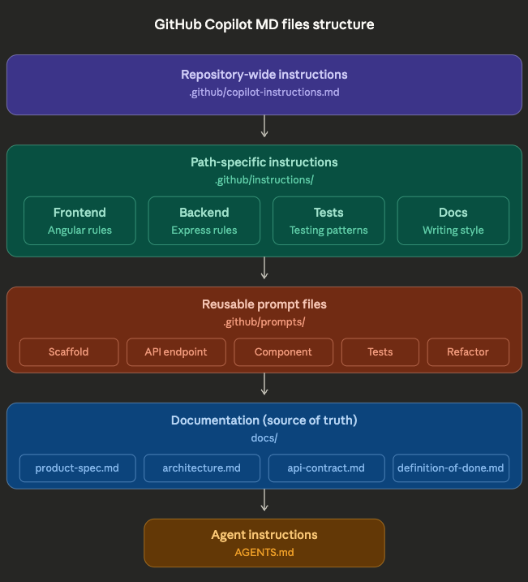

# Task Tracker

A full-stack Task Management application demonstrating GitHub Copilot best practices.

## Tech Stack

- **Frontend**: Angular 17+ with TypeScript
- **Backend**: Node.js with Express
- **Database**: MongoDB with Mongoose
- **Shared**: TypeScript types and Zod validators

## Project Structure

```
task-tracker/
├── .github/
│   ├── copilot-instructions.md          # Repository-wide Copilot rules
│   ├── instructions/                     # Path-specific instructions
│   │   ├── frontend.instructions.md      # Angular patterns
│   │   ├── backend.instructions.md       # Express/MongoDB patterns
│   │   ├── tests.instructions.md         # Testing patterns
│   │   └── docs.instructions.md          # Documentation rules
│   └── prompts/                          # Reusable prompt files
│       ├── scaffold-project.prompt.md    # Initialize the project
│       ├── create-api-endpoint.prompt.md # Create backend endpoints
│       ├── create-angular-component.prompt.md # Create frontend components
│       ├── write-tests.prompt.md         # Write tests
│       └── refactor-safely.prompt.md     # Safe refactoring
├── AGENTS.md                             # Agent workflow instructions
├── docs/
│   ├── product-spec.md                   # What the app does
│   ├── architecture.md                   # How it's structured
│   ├── api-contract.md                   # API documentation
│   └── definition-of-done.md             # Completion criteria
├── apps/
│   ├── web/                              # Angular frontend (to be generated)
│   └── api/                              # Express backend (to be generated)
└── packages/
    └── shared/                           # Shared types & validators (to be generated)
```

---
## Structure:



[Edit Diagram](copilot-structure.drawio)

## How to Use GitHub Copilot with This Repo

### Step 1: Open Copilot Chat in VS Code

Press `Ctrl+Shift+I` (Windows/Linux) or `Cmd+Shift+I` (Mac) to open Copilot Chat.

### Step 2: Scaffold the Project

Copy and paste this prompt into Copilot Chat:

```
Read these files first:
- docs/architecture.md
- docs/product-spec.md
- .github/copilot-instructions.md
- .github/prompts/scaffold-project.prompt.md

Then scaffold the complete Task Tracker monorepo following the instructions.
Create all necessary configuration files, the shared package with types,
the Express backend with MongoDB, and prepare for the Angular frontend.
```

### Step 3: Generate the Backend

```
Read these files:
- docs/api-contract.md
- .github/instructions/backend.instructions.md
- .github/prompts/create-api-endpoint.prompt.md

Create all the API endpoints documented in api-contract.md:
- GET /api/tasks (with filtering)
- GET /api/tasks/:id
- POST /api/tasks
- PUT /api/tasks/:id
- PATCH /api/tasks/:id/toggle
- DELETE /api/tasks/:id

Include the Mongoose model, service layer, routes, and error handling.
```

### Step 4: Generate the Frontend

```
Read these files:
- docs/product-spec.md
- .github/instructions/frontend.instructions.md
- .github/prompts/create-angular-component.prompt.md

Create the Angular frontend with these components:
1. TaskFormComponent - create/edit tasks with validation
2. TaskListComponent - display list of tasks
3. TaskItemComponent - single task with toggle/delete
4. TaskFilterComponent - filter by status and priority
5. TaskService - API communication

Follow the acceptance criteria in product-spec.md.
```

### Step 5: Generate Tests

```
Read .github/prompts/write-tests.prompt.md and docs/product-spec.md.

Write tests for the task creation feature covering:
- Valid task creation
- Title validation (required, 3-100 chars)
- Priority validation
- API error handling
```

### Step 6: Review Against Instructions

After generating code, ask Copilot to verify:

```
Review the generated code against:
- .github/copilot-instructions.md
- The relevant path-specific instruction file

List any violations and suggest fixes.
```

---

## Copilot Best Practices Demonstrated

| Practice | File |
|----------|------|
| Repository-wide rules | `.github/copilot-instructions.md` |
| Path-specific rules | `.github/instructions/*.instructions.md` |
| Reusable task prompts | `.github/prompts/*.prompt.md` |
| Agent workflows | `AGENTS.md` |
| Product requirements | `docs/product-spec.md` |
| Technical architecture | `docs/architecture.md` |
| API documentation | `docs/api-contract.md` |
| Completion criteria | `docs/definition-of-done.md` |

---

## Key Principles

1. **Keep instructions stable and high-level** — Global rules in `copilot-instructions.md`
2. **Put localized rules close to the code** — Path-specific instructions for frontend/backend
3. **Use prompt files for repeatable workflows** — Standard patterns for common tasks
4. **Treat Markdown as executable context** — Specs define what Copilot should build
5. **Make Copilot verify its own output** — Ask it to review against instructions
6. **Separate "what" from "how"** — product-spec = what, architecture = how

---

## Quick Reference: Copilot Chat Commands

| Task | Prompt |
|------|--------|
| Understand the project | "Read docs/architecture.md and explain how this app is structured" |
| Add a feature | "Read docs/product-spec.md and add [feature] following the patterns" |
| Create an endpoint | "Use .github/prompts/create-api-endpoint.prompt.md to create [endpoint]" |
| Create a component | "Use .github/prompts/create-angular-component.prompt.md to create [component]" |
| Write tests | "Use .github/prompts/write-tests.prompt.md for [feature]" |
| Refactor safely | "Use .github/prompts/refactor-safely.prompt.md to improve [code]" |
| Review code | "Review this against .github/copilot-instructions.md" |
